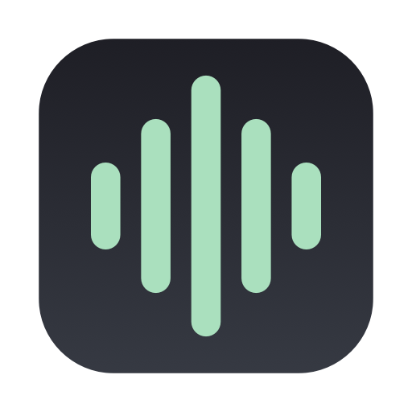
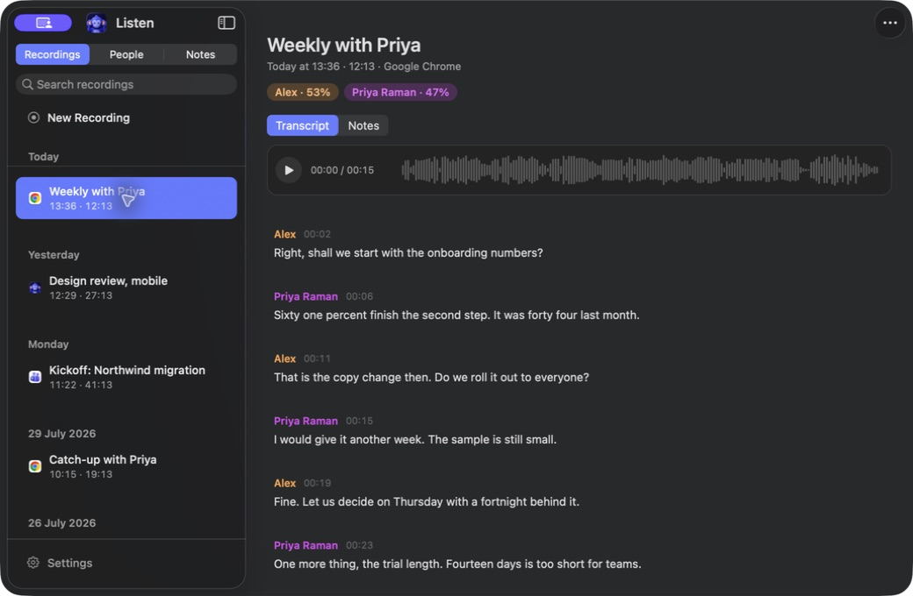

<p align="center">
  
</p>

# Listen

A meeting recorder, transcriber and speaker labeller for macOS that runs
entirely on your Mac.

Press record. Listen captures the call, writes it down, works out who said
what, and remembers voices between meetings so the people you talk to every
week name themselves after the first time.

Then ask it what was decided, and it answers out of your own recordings and
cites the turns it read.

No meeting bot. No calendar invite. No account. Your audio never leaves your own
devices.

Listen is the blue half of the Good Pair: a listening monkey with its hands
behind its ears. In the menu bar, it uses the Good Pair's square listening
seal, carrying 聞 (hear): a quiet nod to the three wise monkeys' Japanese
roots that remains clear at 16 points.

<p align="center">
  
</p>

## What it does

- **Records both sides of a call**, on two separate tracks: your microphone,
  and everything your Mac is playing. It uses a Core Audio process tap, which
  asks for audio recording permission and **not** screen recording.
- **Transcribes locally** with NVIDIA's Parakeet through MLX. About 240 times
  faster than real time on an M4 Max, so an hour-long meeting is written up in
  well under a minute.
- **Separates the speakers** with FluidAudio on the Neural Engine. On a call
  your own track needs no guessing, because the microphone is you and the other
  side is everyone else. With the laptop on the table in a meeting room the
  microphone is carrying the room, and Listen works that out from the recording
  and separates the people around it too.
- **Recognises voices across meetings.** Name someone once and Listen suggests
  them the next time it hears them. Suggestions are ranked and never applied on
  their own.
- **Reads your calendar, with no account to make.** A recording is named after
  the meeting it lines up with, and the people who were invited are offered when
  you name a speaker. Google and Microsoft calendars come through whatever you
  have already added in System Settings, so there is no sign-in, no
  subscription and no server in the middle.
- **Dictates, anywhere on the Mac.** Press a shortcut in any app, talk, press
  it again, and what you said is typed in. The same speech model, still on this
  machine, and the same custom vocabulary the meetings use. This was
  [Speak](https://mugoosse.github.io/speak/), which is now part of Listen.
- **Keeps your own notes**, typed during the call or after it, one per
  recording. An agent can read them and cannot change them.
- **Tags a recording** with what it is about, in your own words, so "the job
  hunt calls" is a thing you can ask for. Filterable in the window, at the
  command line and over MCP.
- **Answers a question about the library.** "What did we decide about
  pricing" reads across every meeting and comes back citing the turns it read,
  in the window or at the command line, and the answer can be kept as a note.
  The model is yours to pick: Claude Code or Codex if you already have them, or
  any OpenAI-compatible endpoint, which includes one running on this Mac under
  Ollama or LM Studio and therefore nothing leaving it.
- **Reaches your other Macs through iCloud**, off until you turn it on.
  Transcripts, notes, people, tags and your dictionary travel between devices,
  sealed before they leave with a key Apple never holds. A lossless copy of the
  audio can travel with them, so a second Mac can play a meeting and transcribe
  it again rather than only read it.
- **Answers to an agent** over MCP. Ask about your own meetings, and have the
  answer written back as a note, which can name several meetings at once. Notes
  and tags are the only things an agent can write: it cannot rename a speaker,
  edit a transcript or delete a recording.

## Requirements

Apple Silicon, macOS 14 or later. System audio capture needs macOS 14.2; on
14.0 and 14.1 Listen records your microphone only.

## Download

**[Download Listen for macOS](https://github.com/mugoosse/listen/releases/latest/download/Listen.dmg)**

Open the downloaded file and drag **Listen** to Applications.

### Other ways to install

Prefer Homebrew?

```sh
brew trust --cask mugoosse/tap/listen
brew install --cask mugoosse/tap/listen
```

The first line is Homebrew 6.0 and later refusing to load a cask from a tap
that is not one of its own until you say so, which is the right default and
worth knowing about rather than meeting as an error. Install without it and
Homebrew stops and tells you the same thing.

The speech model is about 2.5 GB and downloads on first run, after you press
the button that says so. **If you already use
[Speak](https://mugoosse.github.io/speak/), it is already on your disk** and
Listen will find it: both resolve the same Hugging Face cache, so whichever
downloaded first paid for both.

## Using it

The sidebar holds three lists and a switch at the top of it: **Recordings**,
**People** and **Notes**. Recordings is the library by day. People is everybody
Listen has heard, with what they have been in. Notes is every note in the
library, including the ones that are about several meetings at once. Search
scopes to whichever you are in, and while a conversation is open the sidebar
becomes the list of conversations instead.

Start a recording from the menu bar. When you stop, Listen asks whether to keep
it.

That question comes afterwards on purpose. Recording begins the moment you
press Start and writes to disk immediately, so nothing waits on a decision:
a recorder that starts when you confirm has already lost the minute where
everybody says who they are. If you walk away without answering, the audio sits
in a staging folder and is deleted after 24 hours.

Transcription starts on its own once a recording is kept, one job at a time.
Quit halfway through and it picks up where it left off, because a recording
with audio and no transcript simply *is* one that still needs transcribing.

### Playing a recording back

The player above the transcript draws the whole meeting as a waveform, so the
quiet stretches and the busy ones are visible before you click. Click or drag
anywhere on it to move the playhead; scrubbing a paused recording leaves it
paused, because dragging through a meeting to find a moment is a way of reading
it rather than of listening to it.

While it plays, the turn being spoken is tinted and the sentence being spoken
is highlighted inside it, which is what keeps a five-minute paragraph readable
at the speed it is being said. The transcript follows along until you scroll,
and then it stays where you put it.

Clicking any turn plays from there.

### Naming speakers

Click a speaker's name in the transcript and choose **Who Is This?** from the
menu, or click their chip under the title, which opens the same thing directly.
The list starts with the other people in this recording, then whoever the voice
bank ranks this voice against, then anybody on the invitation, then the rest of
your people. Type to filter it, or type a name nobody has yet.

Picking somebody already in the recording folds the two together, which is the
repair for one person arriving as two speakers because they changed seat or
microphone, or because their voice came back in through your own microphone.

**Discard**, at the foot of the list, deletes a phantom speaker: the one that
appears over a stretch of silence with a line of invented filler attached. It is
only offered on a speaker nobody has named, and it says how many turns and how
much time it is about to remove.

Named the wrong person? Click their name, choose **Not <name>…**, and either pick
who it really is or press **Leave Unnamed**, which puts them back to `Speaker A`
in this recording with everything they said intact, ready to be named again.

All of these write a one-time backup of the pipeline's own output before the
first edit. Renaming never re-transcribes.

**Play** in that popover runs through their turns in order and skips everybody
else, which is usually enough to recognise a voice, and the waveform greys the
other speakers so you can see where they talk. The player's own play button is
unaffected and still plays the meeting. Nothing on the page moves either way.

### Correcting who said something

Diarization sometimes hands one paragraph, or one sentence inside a paragraph,
to the wrong person while getting the rest of that speaker right. Renaming
cannot fix that, so there are two smaller edits:

- **Click the speaker's name above a paragraph** and choose *Speaker for This
  Turn*. Either mouse button opens that menu, and everything else about the
  speaker is in it too.
- **Right-click a sentence** and choose *Speaker for This Sentence*, next to
  Edit Sentence.

Both list everybody already in the recording, so the usual fix is one click, and
*Someone Else…* opens the same chooser that names a speaker if the right person
is not in this meeting yet. Only the attribution changes: the words, the timings
and the audio are untouched, and the way back is the same menu on the paragraph
it moved to.

### What you are called

Settings, General. Your own track is written as `Me` and shown as whatever you
put there, in the transcript, the roster and to an agent.

The transcripts keep saying `Me` whatever you choose, which is what makes it
safe to change your mind: every recording you already have reads the same as the
ones you make next, nothing is rewritten, and clearing the field puts `Me` back.

### Meetings in a room

With the laptop on the table, the microphone is carrying everybody rather than
you, and calling that whole track `Me` would file the meeting under one name.
Listen works it out from the recording: nothing was on a call and nothing came
out of the speakers, so nobody was remote, so the microphone is the room. It
then separates the people around the table the way it separates a call, and one
voice on the microphone is still just you.

The one case it cannot call is the meeting that is half in the room and half on
a call, because a system track with speech in it looks the same either way.
Right-click the recording and tick **Recorded in the Room**, and it offers to
transcribe again, which is when who said what is decided.

The first room meeting may not know which voice is yours, and will ask. Listen
takes your voiceprint from your own track on ordinary calls, so it knows you as
soon as one call has been transcribed; `listen enroll <id>` takes it from a call
you already have.

### Correcting the transcript

Right-click the sentence that came out wrong and choose **Edit Sentence**. The
paragraph splits around it, you type, and clicking away saves. Escape leaves it
as it was.

One sentence at a time, because that is the unit the transcript is actually made
of: the correction goes back to the sentence the model produced, so its place on
the clock and its highlight while the recording plays both survive. The
surrounding paragraph stays on screen, dimmed, so you can see what you are
correcting it against.

Nothing re-transcribes, and the one-time backup of the model's own output is the
same one speaker edits write.

### A meeting that was not in English

Parakeet v2 is the default and it only reads English. Handed a call in another
language it does not fail or say anything: it writes fluent English sentences
that nobody said. Parakeet v3 reads 25 languages and works out which one it is
hearing.

The detail pane says which model made the transcript you are looking at, beside
the date and the length. To change it, open the **…** menu and hover
**Transcribe Again**: the models are listed there, with a tick on the one that
produced what is on screen, and the download size on any that is not on your
disk yet. The choice stays with that recording, so a later re-run uses it too.

Transcribing again replaces the transcript, so the speaker names and any
sentences you corrected go with it. Listen asks first when there is something
there to lose. To change the model for *new* recordings instead, use Settings,
Models.

There is deliberately no language menu. The library underneath Listen accepts a
language and then ignores it, so a menu of languages would be a control that
quietly does nothing. Choosing the model is the real choice, which is why that
is the one on offer.

### Your own vocabulary

Settings, Dictionary. Speech models get the same proper nouns wrong the same
way every time, and a meeting is mostly proper nouns, so the list is worth
building once.

- A **term** is a word Listen should know: a name, a product, a piece of jargon.
  Anything that sounds like one and is not a word in its own right becomes it,
  so "Gusens" comes out as "Goossens". A single word needs five letters and is
  never swapped for a real English word, which is what keeps "Codex" from
  rewriting "codes". A phrase needs every word to match by sound in order, which
  is how "Claude Code" catches "Cloud coat".
- A **correction** is an exact replacement, for a mishearing that sounds nothing
  like the word you meant. The longest match wins, so a rule for a full name
  beats one for the first name.

It is applied once, when a meeting is transcribed, to what is written to the
library. Adding a rule does not touch transcripts you already have, and
re-transcribing applies the list as it stands then.

Because it edits an archive rather than something you are watching, every
transcript records which rules rewrote it and how often, and the pane totals
that across the library under **What it changed**. **Try it** runs your rules
over a line you type, which is the way to find out what a term does before it
does it to a meeting.

If you use [Speak](https://mugoosse.github.io/speak/), it keeps its own list and
one press copies it over. The file is not shared, deliberately: two apps
rewriting one document whole means the loser of a race loses entries. Export
writes the file Speak's own import reads, so the list travels back the other way
too, and imports from TypeWhisper are understood as well.

### Your calendar

Settings, Permissions, Calendar. Listen reads the calendars this Mac already
has, which includes any Google or Microsoft account you have added under System
Settings, Internet Accounts. **There is no account to make and nothing to sign
in to**, because macOS has already done that part. It only reads, and never
writes anything back.

Two things come of it. A recording is named after the meeting whose start is
within ten minutes of it, and the people on the invitation are offered when you
name a speaker.

Ten minutes is measured rather than picked. Across a real library of 47
recordings, ten, fifteen and twenty minutes all matched the same fourteen, and
widening to thirty added two matches that were both wrong: a call matched a solo
calendar block half an hour away. A name you typed yourself is never replaced.

Calendars mostly give you an email address rather than a name, so Listen keeps
its own small address book: when you take a suggestion, that address is filed
against the name you chose, and it is offered directly the next time. One person
can have as many addresses as they use. Nothing is written unless you pick
somebody, and typing a name from scratch files nothing.

This is optional, and refusing costs exactly those two things. Recording,
transcription and speaker labelling are unaffected.


## Dictating

Listen types for you as well as writing meetings down. Press **fn + left
shift** anywhere on the Mac, say what you want written, press it again, and the
words go to the clipboard and are typed into whatever you were using. Escape
cancels, and so does the trash button on the floating pill.

It is off until you grant Accessibility, which is the permission that lets
Listen see the shortcut and type for you. Recording meetings never uses it, so
if you only want the recorder you can ignore this entirely. Everything else is
in Settings, Dictation: the shortcut itself, which speech engine to use, the
sounds, and whether the pill appears.

The custom vocabulary is shared. A name Listen mishears in a meeting is the
same name it mishears when you dictate, so a rule you add in Settings,
Dictionary fixes both.

### Tidying up what you said

On macOS 26 with Apple Intelligence, Listen can run what you said through a
copy-editing pass before it reaches the clipboard: punctuation and
capitalisation added, um and uh removed, paragraphs where the topic turns. It
adds about a second and it rewrites your words, so it is off until you ask for
it in Settings, Dictation.

It is a copy editor and never an assistant. A dictated question comes back as a
question rather than an answer, and a sentence you cut off stays cut off. If a
reply ever collapses or grows past what editing can explain, Listen throws it
away and keeps what you actually said.

There is a second pass for false starts, the case where you begin a phrase,
break off and say it again: "send me the notes the meeting notes" becomes "send
me the meeting notes". It only runs on sentences that look like that, which
over a real history is about one dictation in ten.

### Coming from Speak

Speak's dictation is here, and Speak itself is retired. The speech model
carries over on its own, because both apps always used the same download, so
there is nothing to fetch again.

What does not carry over is the configuration: the shortcut, the sounds and the
polishing settings all start at their defaults, and the dictation history stays
in Speak's folder. Set the shortcut again in Settings, Dictation. Your Speak
dictionary can be brought across in one press from Settings, Dictionary.

## Notes

Two kinds, and the difference is the whole design.

**Your own note**, one per recording. Open a recording, click **Notes** beside
Transcript, and there is a cursor: no New Note button, no naming step, and nothing written to
disk until you type. It is plain markdown in a plain text view, because the
value is that it is attached to the meeting and readable by an agent, not that
it is a good editor. It is editable **while the recording is still running**,
which is when it is worth the most: "we should upsell them" is exactly the
context that is in no transcript and can never be reconstructed from one.

**Notes an agent wrote.** A summary, the decisions, the actions, whatever you
asked for. There is no model in Listen that summarises anything, and adding one
is not planned: an agent connected over MCP already has a frontier model, the
transcript, and the question you actually asked. See the MCP section below.

An agent may **read** your own note and may not write it. That asymmetry is the
point of having two kinds: the transcript is evidence, your note is your
thinking, and only the derived one is open to being rewritten.

Notes live in `notes/` beside the recordings rather than inside one, because a
note can be about **several meetings at once**. "Summarise everything with Edgar
in June" spans four recordings and belongs to all of them; the frontmatter names
every one. The Notes tab in the sidebar lists them all, and clicking a meeting
in a note goes to it.

Deleting a recording does not delete notes that mention it. A synthesis of four
meetings must not vanish because one was tidied up, so the note stays and shows
the missing meeting as an id it can no longer resolve.

## Asking your library

The composer sits at the bottom of whatever you are reading, so a question can
be about the meeting on screen or about all of them. "What did we decide about
pricing", "catch me up", "what is still open with Edgar". A conversation opens
into the whole window and the sidebar becomes the list of conversations rather
than going on listing recordings behind a page nobody can see, and an answer
worth keeping is saved as a note that remembers which conversation it came out
of.

**Every claim carries a numbered reference.** Clicking one shows what is behind
it, the recording with its date, length and speakers, or a note, or a person,
and the card is what opens the page. Two clicks rather than one, deliberately: a
citation is read in the middle of a sentence, and a number that swaps the page
under you is one nobody presses twice. The identity is the agent's rather than a
text match, so a library where most recordings are called "New recording" cannot
send you to the wrong meeting, and a reference to something the library does not
have is dropped rather than drawn.

An answer with no tool call behind it and nothing earlier in the conversation to
draw on is flagged rather than trusted. A model that advertises tool support
will still answer from nothing if you let it.

There are two shapes of backend, and choosing between them is the privacy
decision:

- **An agent CLI you already have.** Claude Code or Codex, whichever is
  installed and signed in. Each brings its own tool loop and reads the library
  through the same tools `listen mcp` serves, so a question costs nothing beyond
  the subscription already paid for.
- **Any OpenAI-compatible endpoint.** Twelve are set up in one press: Ollama, LM
  Studio and llama.cpp on this Mac, and OpenRouter, OpenAI, Groq, Cerebras,
  Together, Fireworks, Mistral, DeepInfra and xAI off it. Any other URL can be
  typed in, several can be configured at once, and the composer switches between
  them. A provider is one stateless request, so Listen runs the tool loop itself.

**A model on this Mac is the case this app should be best at**, and it is the
only one that costs nothing to try. Measured on four questions with checkable
answers against a five-recording library: `qwen3.5:35b` at 23 GB answered all
four in 7 to 18 seconds, and the 81 GB model matched it at roughly three times
the wall clock, so the larger download buys nothing on this task.

An endpoint that is not on this machine says in words that your transcripts go
to it, before you save it. Keys live in the Keychain and never in preferences.
Nothing is ever asked in the background: transcripts travel at the moment you
press send and at no other time.

Ask is read-only unless you say otherwise. `listen ask --write`, and the
window's own equivalent, let it add notes and tags, which are the same two
things MCP allows and for the same reason.

At the command line, `listen ask` with no question reports what is set up, and
`listen ask --to http://localhost:11434/v1 "..."` tries an endpoint for one run
without changing a preference.

## Your devices

Off until you turn it on, in Settings, Sync. With it on, Listen keeps your
library in step through **your own private CloudKit database**. There is no
Listen account, no Listen server, no LAN listener and no shared folder.

Every payload is sealed on the device before it is uploaded, with a 256-bit key
that lives in iCloud Keychain, so CloudKit holds opaque record names and
encrypted bytes. Settings, Sync can show that key, so a copy can go in a
password manager: lose every device and that copy is the only thing that opens
what iCloud is holding.

There is nothing to pair, no QR code and no network address. Both devices on the
same Apple Account with iCloud Keychain on is the entire setup, because the key
arrives by itself.

### What travels

Transcripts, turns, waveforms, metadata, notes, people, contacts, tags and your
dictionary, to every device. Voiceprints travel between Macs only, and so does
forgetting one: `listen forget <name>` writes a sealed tombstone that every
device applies on every pass, so a stale Mac cannot push a forgotten voice back
into the bank.

### The audio, on every device

Until 0.16.0 only the Mac that recorded a meeting had its audio, and every other
device held a transcript it could not play or re-run. Listen can now publish a
lossless master: the microphone and the system track kept apart as the two
channels of one stereo FLAC, so a re-transcribe on another device still
separates the two sides.

Measured on a 1.07 hour meeting, 494 MB of raw tracks becomes a 61 MB master in
3.8 seconds, about an eighth of the size.

**Keep audio**, in Settings, Sync, decides whether this device holds a copy, and
the same pane lists every device with what it keeps and what it is actually
holding. A device frees its own copy only once another live device that is
keeping audio reports **holding** the bytes, never on the strength of the
network alone. `listen audio` says the same at the command line, and `listen
audio <id> --build` makes one master here and reports what it cost.

### Who is transcribing

A recording being worked on names the Mac doing it and when it started, so two
devices never race for the same one, and a claim that goes nowhere expires after
six hours rather than parking the recording forever. `listen transcribe <id>`
takes the same lease as the background queue, so running it by hand is not a
second way in.

A finished recording says how long it took, on every Mac, because that is the
same fact whether the library has one device in it or three. The machine is
named only when it was not the one you are looking at: "transcribed on Studio in
21 s" on the laptop, and "transcribed in 21 s" on the Studio itself.

`listen sync inspect --recording <id>` is what to reach for when a recording is
stuck waiting on audio: it says who holds it, whether a transfer is in flight,
and what the manifest actually names, across every zone.

### Undo

A recording or note removed by a sync from another device is kept for fourteen
days before it is really gone. `listen sync trash` lists what is being held, and
putting something back is a matter of moving the folder into `recordings/` or
`notes/`. Listen also refuses to tell iCloud that everything has gone: a library
that is suddenly empty is far more likely to be a disk that did not mount, or a
restore in progress, than a decision to delete every meeting at once.

[`SYNC.md`](SYNC.md) is the reference, including what a fork has to do to run
sync on a CloudKit container of its own.

### The iPhone

The other half of Listen, for the conversations that happen in a room rather
than on a call, is being built for iPhone. It is not out yet.

## Deploying it somewhere regulated

Listen gets used where the recording itself is the reason a cloud product is
disqualified: therapy, medicine, law, HR, journalism. Three pages answer what a
security questionnaire asks and where it lands against HIPAA and GDPR:
[security](https://mugoosse.github.io/listen/security.html),
[privacy](https://mugoosse.github.io/listen/privacy.html) and
[HIPAA](https://mugoosse.github.io/listen/hipaa.html).

An organisation can force Listen's settings with an ordinary MDM configuration
profile for the `com.mgo.listen` domain. There is no schema of Listen's own: the
keys are the app's own preference keys, pushed through the standard
managed-preferences payload, so any MDM that can force a plist key can manage
Listen. A forced setting beats both the panes and the CLI, and the control that
would have changed it is disabled with a sentence saying the profile decided.

| key | forced to | what it does |
|---|---|---|
| `cloudSync` | `false` | the library never reaches iCloud. Apple signs no Business Associate Agreement for iCloud, so a library holding regulated data must not sync through it. |
| `agentLoopbackOnly` | `true` | Ask is restricted to endpoints on this Mac. Hosted providers cannot be added, ones added earlier are refused at run time, and the Claude and Codex backends are refused outright. |
| `dictationHistoryDisabled` | `true` | `dictations.jsonl` is not written. Dictation itself keeps working. |
| `backupsDisabled` | `true` | no daily copies under `~/Backups/Listen`. |
| `backupsPath` | a path | the daily copies move, onto an encrypted volume for instance. |

[`docs/listen-managed.mobileconfig`](docs/listen-managed.mobileconfig) is a
complete sample and [`docs/MANAGED.md`](docs/MANAGED.md) explains it, including
how to check that a profile took.

`listen activity` is the audit trail: every tool call, agent run, export,
deletion and backup, by name and id only and never by content.
`./verify_compliance.sh` asserts that claim, and the rest of this section,
against a built app.

## The command line

Install it from Settings, Developers. It is the same binary as the app,
symlinked rather than copied, so it never falls behind the app it came from.

`listen help` prints the whole thing. The shape of it:

```
listen record [--seconds N]       capture until stopped, or for N seconds
listen transcribe <file|id>       transcribe a file, or a whole recording
listen list [--limit N] [--tag T] recordings as a table
listen show <id>                  metadata and transcript
listen export <id> [--format]     write a transcript out
listen title <id> [<text>]        what one recording is called

listen label <id> <speaker> ...   name, merge, discard or move a speaker
listen edit <id> <old> <new>      correct one sentence of a transcript
listen people [<name>]            who is in the library, or where one person is
listen rename / merge / unname    one person, across every recording
listen forget <name>              strip their voiceprints from every bank, on
                                  every Mac. Transcripts are untouched.
listen me [<name> | --clear]      what the microphone track is called on screen
listen enroll [<id>...]           re-derive voiceprints for named speakers
listen voices <id> [--apply]      who the bank thinks each unnamed speaker is
listen calibrate                  voiceprint threshold report

listen dictate <file>             run the dictation pipeline over a file
listen polish [text|-]            polish and correct text, as a dictation would
listen dictations [--limit N]     what you have dictated

listen ask [<question>]           put a question to Claude Code, Codex or an
                                  endpoint, all reading through `listen mcp`
listen provider <sub>             the OpenAI-compatible backends
listen mcp                        stdio MCP server

listen notes <sub>                the notes, one or many recordings each
listen tags <sub>                 what the recordings are about, in your words
listen dictionary <sub>           your own terms and corrections
listen calendar <sub>             the calendars on this Mac, and what they name
listen contacts <sub>             which address belongs to which person

listen sync <sub>                 status, inspect, trash, key, enable
listen audio [<id>] [--build]     what audio exists and which devices keep it
listen backup [--now]             the local copies of the library
listen activity [--limit N]       what has touched the library. Ids, never
                                  content.
listen import <path>              bring in a meet_transcriptions library
listen sources                    what meeting detection sees, during a call
listen changelog [<version>]      what changed, from the notes in this copy
```

`listen calendar match <id>` is the one worth knowing about. Naming happens
silently, so it prints every meeting that could have been the one, how many
minutes each is away, and which one won:

```
$ listen calendar match 2026-08-03-160054-D478
Ryan Mitchell - Meridian
started 3 Aug 2026 at 16:00

→   -1m  Emily Carter and Ryan Mitchell
    Google / Home · 16:00 · 2 invited
    https://us02web.zoom.us/j/00000000000
    · Emily Carter <emily.carter@example.com>  [you]
    · Ryan Mitchell <ryan.mitchell@example.org>  [organizer]
```

`listen calendar backfill` does the same over your whole library and changes
nothing without `--apply`.

`listen transcribe some.wav` needs no permissions at all, which makes it the
fastest way to tell a model problem apart from a recording problem. It prints
what the model actually said: the dictionary applies to what goes into the
library and nothing else, so this command cannot be quietly editing its own
output.

```
listen dictionary list            every entry, and what each has changed
listen dictionary add <term>      a word to spell right, matched by sound
listen dictionary add <a> <b>     an exact replacement
listen dictionary test "<line>"   what your rules would do to a sentence
listen dictionary import --from-speak
listen dictionary export [<path>]
```

```
listen notes list [<id>]          every note, or those about one recording
listen notes read <slug>          one note, body on stdout
listen notes write "<title>" --recording <id>    add one
listen notes delete <slug>        remove one
```

```
listen tags                       every tag, and how many recordings
listen tags add <id> "job hunt"   tag a recording
listen tags remove <id> <tag>     take one off
listen tags rename <tag> <new>    rename it in every recording
listen tags delete <tag>          take it off everything
listen list --tag "job hunt"      only those. Repeat it; several mean all.
```

A tag is free text, so quote one with a space in it. It lives on the recording,
so deleting a meeting takes its tags with it and a tag nothing carries stops
existing: there is no separate list to keep tidy. That is the opposite of a
note, which lives in the library and can outlive any one meeting, and both are
on purpose.

```
listen ask                        what is set up, and nothing else
listen ask "<question>"           through whichever backend is configured
listen ask --to <url> "<q>"       one run against a URL, changing no preference
listen ask --write "<q>"          let it write notes and tags. Read-only without.
listen ask --print-request        the POST body it would send, minus the key
listen provider list              the endpoints this Mac knows about
listen provider add <id>          one of the twelve, or a URL of your own
```

`--print-request` and `--print-command` are the honest way to find out what an
Ask actually sends before it sends it. Neither runs anything.

```
listen sync status                what this build can reach, and as whom
listen sync inspect               what is in the container, by zone
listen sync inspect --recording <id>
                                  one recording across every zone: who holds
                                  the audio, and what is in flight
listen sync trash                 deletions received in the last fortnight
listen sync key [--show]          the key that seals what iCloud holds
listen sync enable [--on|--off]   sync this Mac's real library
listen sync --fake                every seam of the sync, offline

listen audio                      what this Mac holds, and what each device keeps
listen audio <id> --build         make one master here, and say what it cost
```

## MCP

```json
{
  "mcpServers": {
    "listen": {
      "command": "/usr/local/bin/listen",
      "args": ["mcp"]
    }
  }
}
```

Settings, Developers has this ready to copy with the right path filled in.

Opens no port, and the app does not need to be running: the library on disk is
the source of truth.

**Notes and tags are the only things an agent can write.** Everything else is
read-only, and that is a boundary rather than a milestone. An agent can add,
rewrite and delete the notes it wrote, and tag and untag a recording; it can
read your own note and not change it; and it cannot rename a speaker, correct a
transcript, retitle a recording or delete one.

The line is between evidence and opinion. The transcript is a record of what was
said. A note is somebody's reading of it and a tag is somebody's filing of it,
both reversible and both visible in the window the moment they land, so a wrong
one is a wrong opinion sitting beside the recording that disproves it. A wrong
transcript edit is a fact that is simply gone. Changing the evidence goes through
you, in the window or at the command line, where you can see it and undo it.

Thirteen tools, eight of them reads. [`MCP.md`](MCP.md) is the reference: how to
connect each client, what every tool takes, and how to walk a large library
without reading it whole.

## Where things are kept

`~/Library/Application Support/Listen/recordings/<id>/`

```
metadata.json      title, recorded_at, duration, source, state, your tags,
                   which device transcribed it, and the calendar event it was
                   matched to
mic.wav            your track
system.wav         everyone else
master.flac        both tracks losslessly in one stereo file, which is what
                   travels between devices and what a Mac splits back apart
mix.m4a            generated on demand for playback
waveform.json      the scrubber's envelope, also on demand
transcript.json    segments with speakers
turns.json         condensed per-speaker turns
embeddings.json    one voiceprint per speaker
source-icon.png    the icon of the app the call was in
<id>.raw.json.bak  the pipeline's own output, written once, before your first
                   correction to this recording
```

A Mac that was given a master and never had the tracks is the ordinary state of
a second machine. Both playback and `listen transcribe <id>` split the master
back into `mic.wav` and `system.wav`, use them, and remove what they wrote.

```
~/Library/Application Support/Listen/notes/<slug>.md
```

One markdown file per note, with frontmatter saying who wrote it, what they were
asked for, and which recordings it is about. Beside the recordings rather than
inside one, for the same reason `dictionary.json` and `contacts.json` are: a
note can name four meetings, so it is about the library rather than about any
one folder in it.

Two lists sit beside the recordings rather than inside one, because they are
about the library as a whole: `dictionary.json` and `contacts.json`. So do the
notes, for the same reason.

One folder per recording, and no database anywhere. The folders *are* the
library and the `embeddings.json` files *are* the voice bank, which means
deleting a recording in Finder is a supported operation rather than a way to
corrupt an index.

The guest list is copied into `metadata.json` rather than looked up when needed,
so a recording keeps answering after the meeting is deleted from the calendar or
you take the permission away again.

When iCloud sync is on, or after `listen backup --now`, Listen also keeps
copies at `~/Backups/Listen`: a daily APFS clone of the whole library, seven
kept, and a nightly tarball of the sidecars without audio, thirty kept. The
folder is readable by your account alone. A recording you delete stays in
those copies until they age out, which is the point of a backup and worth
knowing when a delete has to be final: `listen backup` says what is there.

Because it is only folders, a file sync tool is enough to read the same library
on a second Mac, and it is what people did before iCloud sync existed. Listen's
own sync is the supported route now, and [`SYNC.md`](SYNC.md) is the guide.

## What leaves your Mac

With everything at its defaults, two things, both declared in
`InternetAccessPolicy.plist` for firewall tools like Little Snitch:

- **huggingface.co**, once, to download the speech model.
- **github.com**, at launch and every six hours after, to check for an update.

Two more exist only if you turn them on, and are in the same policy file:

- **iCloud sync**, off by default. Everything Listen puts in your private
  CloudKit database is sealed on your devices with a key Apple never holds, so
  Apple stores ciphertext it cannot read. [`SYNC.md`](SYNC.md) says exactly
  what travels and what stays.
- **The agent endpoint**, unset by default. If you point Settings, Ask at a
  hosted provider, transcripts of the meetings you ask about are sent to it,
  at the moment you ask and never in the background. An endpoint on this Mac,
  which is what Ollama gives you, sends nothing anywhere.

A managed deployment can force both of them off. See
[Deploying it somewhere regulated](#deploying-it-somewhere-regulated).

Audio leaves only through sync, sealed, and only to your own devices: as a
lossless master when Keep audio is on, and as a phone-to-Mac transfer when a
memo recorded on the iPhone comes over to be transcribed. There is no
telemetry. Reading your calendar adds nothing to this list: it is
the local calendar store, not a network call, which is the reason the feature
needs no account.

The MCP server adds nothing either, because it opens no port and speaks over a
pipe. What it does do is hand transcript text to whatever is on the other end of
that pipe, and if that is a cloud model then those turns go wherever that model
runs. Listen cannot know and does not decide; connecting an agent is a choice
you make, and the notes it writes come back and stay local. Nothing connects on
its own.

## Screenshots and demo clips

`./make_demo_library.sh` writes a library of invented meetings to
`/tmp/listen-demo`: made-up people, made-up companies, and speech synthesised
with `say`, so nothing published anywhere is a recording of anybody.

```sh
./make_demo_library.sh
LISTEN_LIBRARY=/tmp/listen-demo LISTEN_DEMO_NAME=Alex \
  Listen.app/Contents/MacOS/Listen
```

`LISTEN_LIBRARY` points the app at another library and touches nothing in
`~/Library/Application Support/Listen`. A Finder launch inherits no shell
environment, so the app has to be started from a terminal for it to be seen.

The site at [mugoosse.github.io/listen](https://mugoosse.github.io/listen/) is
built from `docs/`. Its seven features are a switcher rather than seven
sections, each with a slot for a short screen recording, and it looks for
`docs/shots/<name>.mp4` the first time a feature is opened. So a clip is added
by dropping the file in and pushing, with no edit to the page.
[`docs/SHOTS.md`](docs/SHOTS.md) is the shot list: what each clip has to show,
against which meeting in the demo library, and what to export.

## Building it

```sh
./build.sh      # xcodebuild wrapper
./make_app.sh   # wraps the binary in a signed .app
./install.sh    # both, then installs to /Applications
```

`swift build` produces a binary that dies at runtime with "Failed to load the
default metallib", because SwiftPM never compiles MLX's Metal kernels. Use the
scripts. `CLAUDE.md` has the rest of the traps.

## Credits

Parakeet by NVIDIA, run through [mlx-audio-swift](https://github.com/Blaizzy/mlx-audio-swift)
and [MLX](https://github.com/ml-explore/mlx-swift). Diarization and speaker
embeddings by [FluidAudio](https://github.com/FluidInference/FluidAudio).
Updates by [Sparkle](https://sparkle-project.org). The process tap approach
follows [AudioTee](https://github.com/makeusabrew/audiotee).

## Licence

Copyright (C) 2026 Maxime Goossens.

Listen is free software under the [GNU Affero General Public License v3.0](LICENSE).
You may use, study, modify and redistribute it, and any distributed derivative
must also be AGPL 3.0 and ship its source.

The licence is deliberate rather than incidental. The claim this app makes is
that your audio never leaves your Mac, and a privacy claim nobody can check is
a marketing sentence. Being able to read the code, and to see
[`InternetAccessPolicy.plist`](InternetAccessPolicy.plist) name the only two
hosts it ever talks to, is the evidence.
