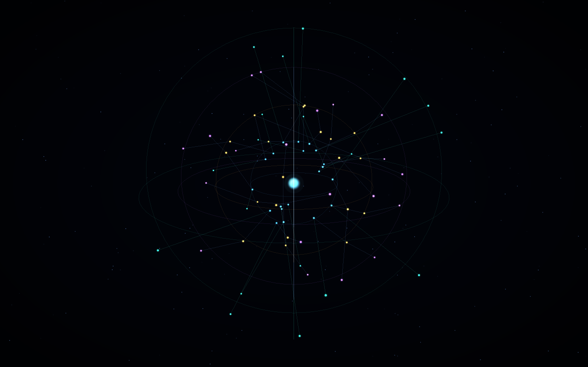
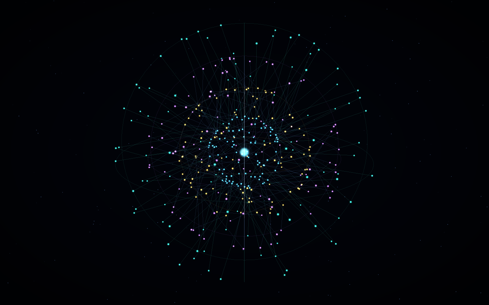

# Native galaxy follow-up

This is an isolated experiment, not a production feature. Unchecked items are outstanding work, not claims of completion. Keep follow-up changes inside the spike unless production integration is explicitly approved.

## Before marking the spike ready

- [ ] **Restore a clean build against upstream `3d5f9ef`.** Resolve the scoped source dependency closure in [build.sh](build.sh): [MemoryPreferences.swift](../../Sources/ListenKit/MemoryPreferences.swift) now references [CloudRecords.swift](../../Sources/ListenKit/CloudRecords.swift). Use real source types, not stub replacements. Verify from an empty build directory, then run `bash verify.sh --ui`; record the actual result. Do not change production memory semantics to accommodate the spike.
- [ ] **Repeat verification on the updated base.** Run [verify.sh](verify.sh), including [focus cancellation](tests/test_focus_cancellation.swift), [animation policy](tests/test_animation.swift), [library privacy](tests/test_library.swift), and [shell layout](tests/test_shells.swift). Recheck the production [memory-core harness](../../tools/verify_memory_core.sh); report any baseline harness failure separately. Earlier green results predate the upstream merge.
- [ ] **Review actual visible-window behavior with Max.** Check shell spacing, edge legibility, orbit/pan/zoom, hover, selection focus, Reset and evidence inspection. During an active focus flight, toggle Pause, Reduce Motion, Low Power and visibility: the camera must settle consistently with picking/labels, request a final redraw, and leave no continuous timer. Hidden presentation should resume with the correct settled frame. Current controller tests verify redraw requests, not visible presentation. See [GraphViewController.swift](GraphViewController.swift), [GraphAnimation.swift](GraphAnimation.swift), and Apple's [MTKView scheduling controls](https://developer.apple.com/documentation/metalkit/mtkview).
- [ ] **Capture full native-window evidence once Screen Recording permission is available.** Include labels and evidence inspector, not just the GPU canvas; use synthetic data. Current previews below are actual offscreen Metal exports from the last working executable, not OS screenshots or proof that the latest source rebuilds.

## Data and product decisions before integration

- [ ] **Implement real Ask conversation ingestion only after verifying storage and privacy semantics.** Preserve authoritative IDs, exclusions, provenance, deletion behavior and truthful empty states. The synthetic chat shell is not live Ask support. See [GraphLibrary.swift](GraphLibrary.swift), [GraphBridge.swift](GraphBridge.swift), and the [contract](CONTRACT.md#updated-visual-direction).
- [ ] **Validate a populated provenance-backed library with explicit permission.** Exercise corrected, conflicted, historical, negative and attributed claims, source-only graphs, proof invalidation and live exclusions. Keep raw private content out of screenshots, logs and repository artifacts. See [GraphProjection.swift](Sources/GraphProjection.swift), [ContextSync.swift](../../Sources/ListenKit/ContextSync.swift), and [test_core.swift](tests/test_core.swift).
- [ ] **Decide presentation of projects, organizations, topics and claims.** Do not silently turn them into people, notes, chats or recordings. Agree filters/contextual views and retain omission disclosure. See [GraphScene.swift](Sources/GraphScene.swift) and [CONTRACT.md](CONTRACT.md).
- [ ] **Connect evidence navigation to production Listen only with explicit integration approval.** Support recording playback offsets, speaker context where actually available, and current source/proof revalidation. Current spike opens verified text and displays offsets; it does not seek production playback. See [GraphEntry.swift](GraphEntry.swift) and [GraphLibrary.swift](GraphLibrary.swift).
- [ ] **Define snapshot refresh and lifecycle integration.** Replace manual Reload only after choosing appropriate change notifications, bounded recomputation and invalidation on exclusion/deletion. Keep the current-device node presentation-only, with no invented relationship edges. See [GraphScene.swift](Sources/GraphScene.swift), [GraphLayout.swift](Sources/GraphLayout.swift), and [GraphBridge.swift](GraphBridge.swift).

## Hardening and performance

- [ ] Release closed evidence windows from the retention array; verify repeated open/close cycles do not accumulate windows. See [GraphEntry.swift](GraphEntry.swift).
- [ ] Surface command-buffer creation/submission failures after renderer initialization instead of silently returning. Test the error state without claiming a successful frame. See [GraphRenderer.swift](GraphRenderer.swift).
- [ ] Rerun shell benchmarks at 80/400/1200 total nodes, including label cost, dense topology, layout cost and memory. Measure idle and active rendering alongside recording/transcription. Do not substitute earlier cluster-fixture throughput or offscreen GPU timing for screen FPS. See [benchmark.py](benchmark.py), [GraphGPUProbe.swift](GraphGPUProbe.swift), and [README.md](README.md#earlier-cluster-fixture-performance-measurements).
- [ ] Validate full production build, macOS 14 deployment compatibility, and Xcode GPU profiling on an equipped machine. iOS reuse needs a separate platform/UI plan; the current spike is AppKit-only. See Apple's [MetalKit documentation](https://developer.apple.com/documentation/metalkit).

## Visual reference and implementation map

- User-approved specification: [CONTRACT.md](CONTRACT.md). Device at origin; concentric spherical bands: People (5), Notes (9), Ask conversations (13), Recordings (17). Edges influence angular placement; ambient motion is decorative, not source activity.
- Web design reference, pinned to the audited revision: [max-os-galaxy at `9df0a56`](https://github.com/mugoosse/max-os-galaxy/tree/9df0a561ee01f92d57a824bbb46cf64dfac96421), especially [GalaxyCanvas.tsx](https://github.com/mugoosse/max-os-galaxy/blob/9df0a561ee01f92d57a824bbb46cf64dfac96421/src/GalaxyCanvas.tsx), [graphMotion.ts](https://github.com/mugoosse/max-os-galaxy/blob/9df0a561ee01f92d57a824bbb46cf64dfac96421/src/graphMotion.ts), and [nodeVisual.ts](https://github.com/mugoosse/max-os-galaxy/blob/9df0a561ee01f92d57a824bbb46cf64dfac96421/src/nodeVisual.ts). These are visual/interaction references, not a claim of pixel parity or a reused web renderer.
- Native implementation: [renderer](GraphRenderer.swift), [camera](GraphCamera.swift), [motion](GraphMotion.swift), [scene](Sources/GraphScene.swift), and [shell forces](Sources/GraphLayout.swift).

## Synthetic previews

Generated using the last working executable with `--nodes 80 --probe results/demo-overview.png --frames 1` and `--nodes 400 --probe results/demo-dense.png --frames 1`. Both are actual 1280 × 800 GPU exports. Counts include the device center. These exclude AppKit labels, inspector and window chrome; they do not validate the current post-merge build.

### Overview: 80 total nodes, 59 edges

### Denser scene: 400 total nodes, 299 edges

